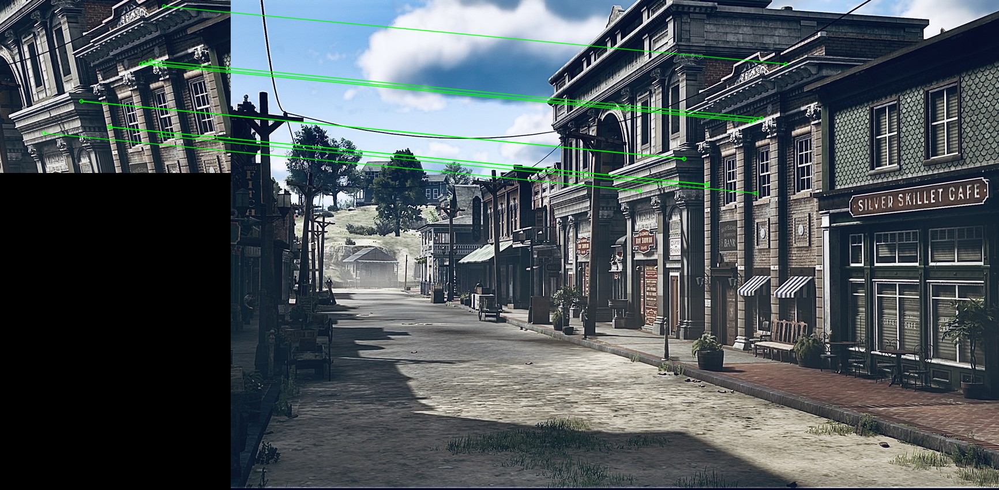
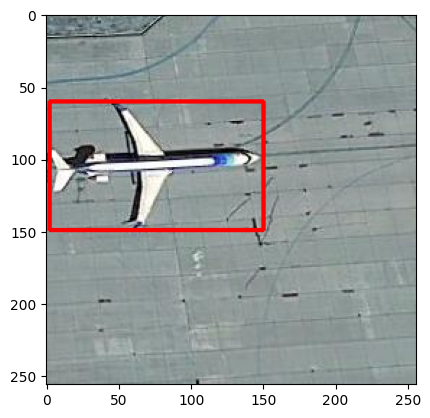
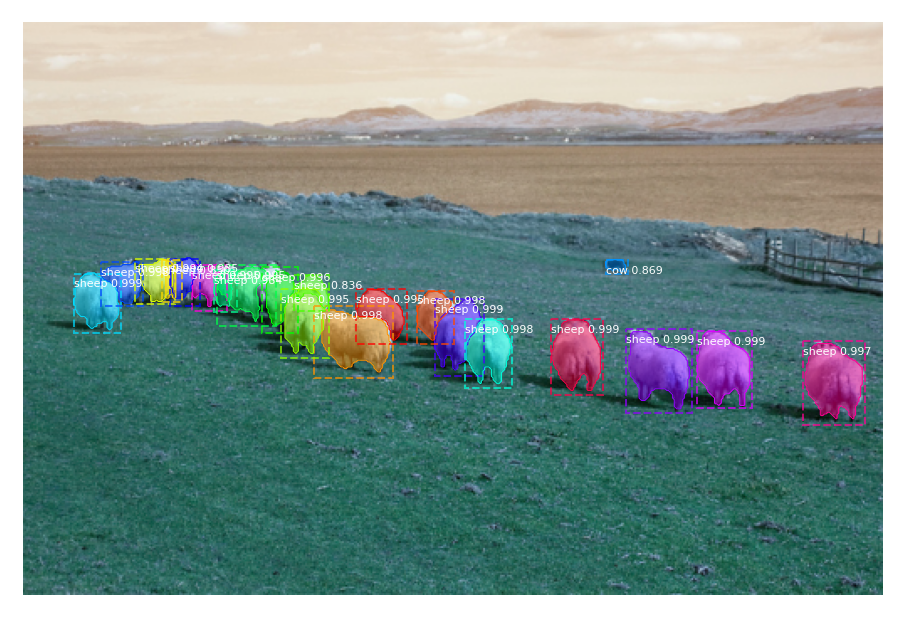

Репозиторий хранит в себе небольшие проекты по компьютерного зрения. Репозиторий создан, чтобы показать опыт работы с теми или иными инструментами работы методов компьютерного зрения.

## Descriptors:

## Recognition with DL:

## Segmentation with DL:
